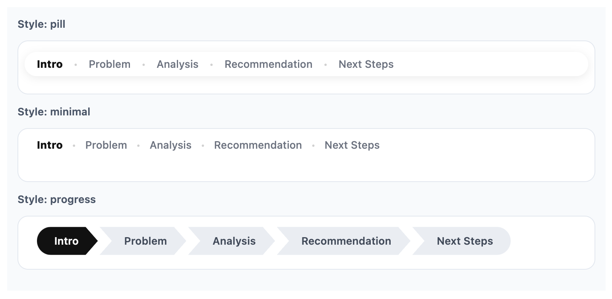
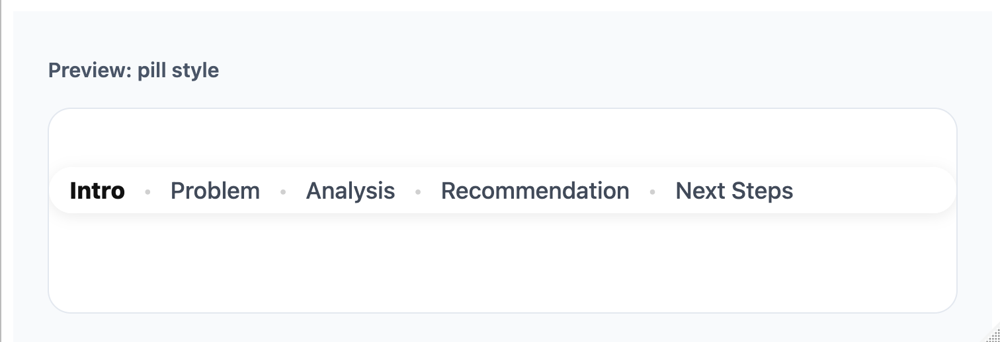
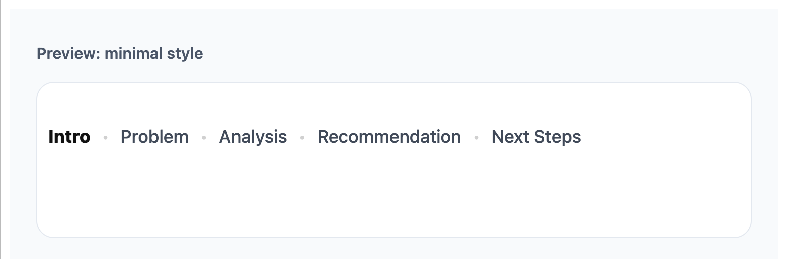
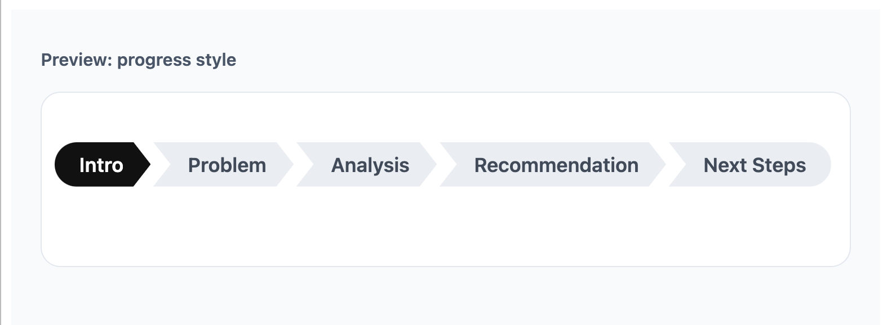
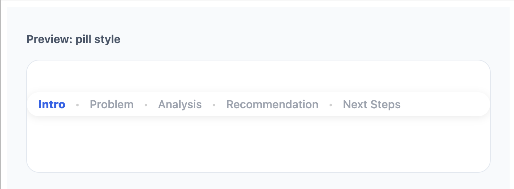
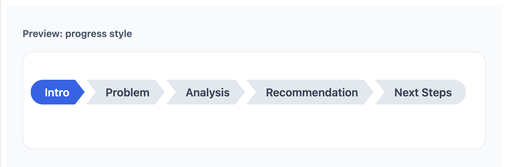

# deckroadmap

[](https://lifecycle.r-lib.org/articles/stages.html#experimental)

`deckroadmap` adds PowerPoint-style roadmap footers to Quarto and R
Markdown Reveal.js slides.

It helps audiences see what has been covered, what section they are
currently in, and what comes next. The package supports multiple
built-in styles, including `pill`, `minimal`, and `progress`, along with
options for colors, size, and positioning.



## Installation

``` r
# install.packages("pak") 
pak::pak("CodingTigerTang/deckroadmap")
```

Or with remotes:

``` r
remotes::install_github("CodingTigerTang/deckroadmap")
```

## Why use deckroadmap?

Many business, teaching, and conference presentations use a roadmap bar
to help orient the audience during the talk. `deckroadmap` brings that
pattern to Reveal.js slides in a simple R-friendly way.

With one function call, you can add a persistent footer that marks:

- completed sections

- the current section

- upcoming sections

## Supported formats

`deckroadmap` currently supports:

- Quarto Revealjs presentations

- R Markdown Revealjs presentations

It is designed for Reveal.js-based HTML slides.

## Basic usage

Add `use_roadmap()` near the top of your document, then tag each slide
with a section name using data-roadmap.

``` r
library(deckroadmap)

use_roadmap(
  c("Intro", "Problem", "Analysis", "Recommendation", "Next Steps"),
  style = "pill"
)
```

Then use matching section labels on your slides, for example:

``` markdown
## Welcome {data-roadmap="Intro"}

## The problem {data-roadmap="Problem"}

## Analysis overview {data-roadmap="Analysis"}

## Recommendation {data-roadmap="Recommendation"}

## Next steps {data-roadmap="Next Steps"}
```

## Full examples

Full working examples are included in the `examples/` folder:

- `examples/quarto-demo.qmd`
- `examples/rmarkdown-demo.Rmd`

These show complete Reveal.js slide documents for Quarto and R Markdown.

## Previewing styles

You can preview a roadmap style locally before rendering slides by using
`preview_roadmap()`.

``` r
preview_roadmap(
  sections = c("Intro", "Problem", "Analysis", "Recommendation", "Next Steps"),
  current = "Analysis",
  style = "progress"
)
```

Because this README renders to GitHub Markdown, the live HTML preview is
not shown here. The screenshots below were generated locally from the
preview function.

## Styles

`deckroadmap` currently includes three styles.

### `style = "pill"`

A rounded floating footer with a soft background.

``` r
use_roadmap(
  c("Intro", "Problem", "Analysis", "Recommendation", "Next Steps"),
  style = "pill"
)
```



### `style = "minimal"`

A lighter text-only roadmap with less visual weight.

``` r
use_roadmap(
  c("Intro", "Problem", "Analysis", "Recommendation", "Next Steps"),
  style = "minimal"
)
```



### `style = "progress"`

A connected progress-style roadmap with section blocks.

``` r
use_roadmap(
  c("Intro", "Problem", "Analysis", "Recommendation", "Next Steps"),
  style = "progress"
)
```



## Customization

You can control font size, bottom spacing, text colors, and, for
`progress`, background colors.

### Text styling

``` r
use_roadmap(
  c("Intro", "Problem", "Analysis", "Recommendation", "Next Steps"),
  style = "pill",
  font_size = "14px",
  bottom = "12px",
  active_color = "#2563eb",
  done_color = "#374151",
  todo_color = "#9ca3af"
)
```



### Progress style with background colors

``` r
use_roadmap(
  c("Intro", "Problem", "Analysis", "Recommendation", "Next Steps"),
  style = "progress",
  active_color = "#ffffff",
  done_color = "#ffffff",
  todo_color = "#334155",
  active_bg_color = "#2563eb",
  done_bg_color = "#475569",
  todo_bg_color = "#e2e8f0"
)
```


