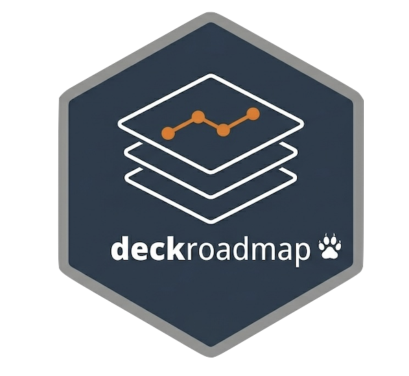
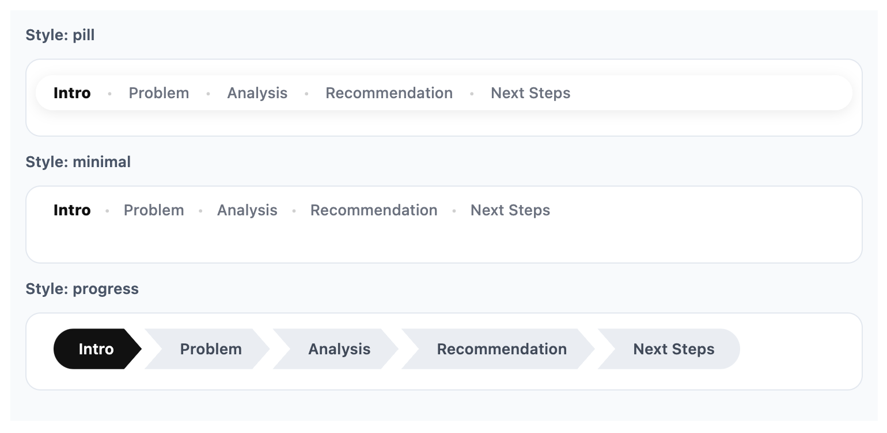
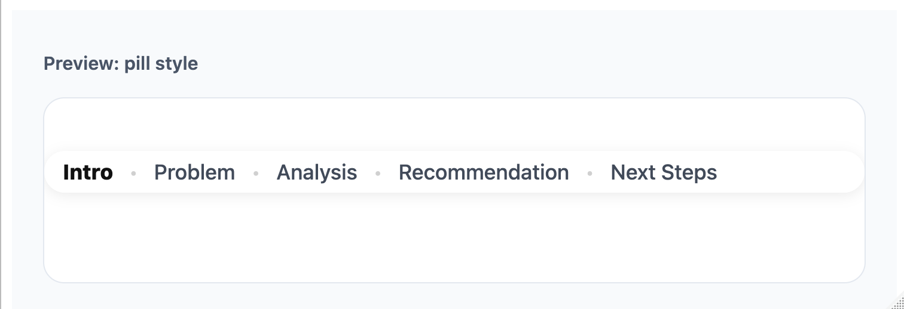
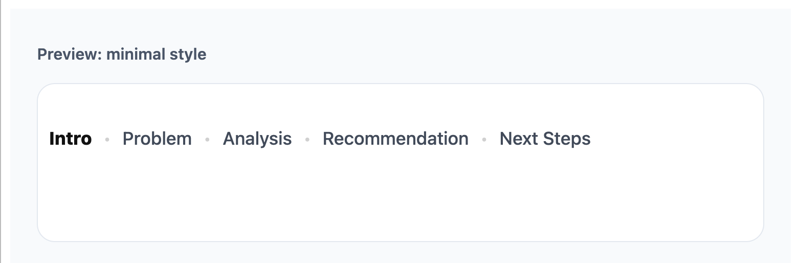
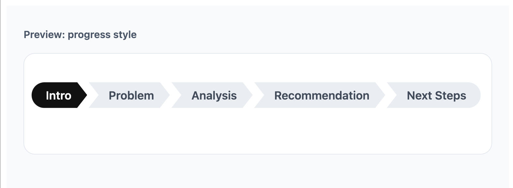
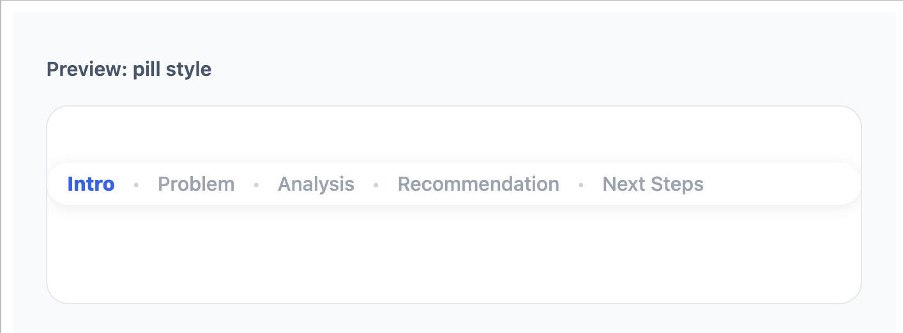
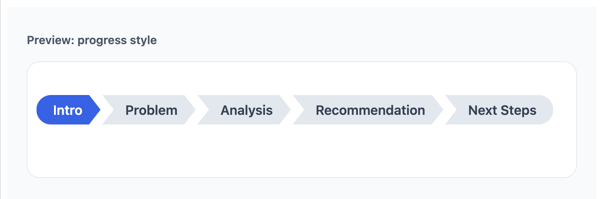

# deckroadmap

[](https://lifecycle.r-lib.org/articles/stages.html#stable)
[](https://cran.r-project.org/package=deckroadmap)
[](https://github.com/CodingTigerTang/deckroadmap/actions/workflows/R-CMD-check.yaml)
[](https://codingtigertang.r-universe.dev/deckroadmap)

`deckroadmap` adds PowerPoint-style roadmap footers to Quarto and R
Markdown Reveal.js slides.

It helps audiences see what has been covered, what section they are
currently in, and what comes next. The package supports multiple
built-in styles, including `pill`, `minimal`, and `progress`, along with
options for colors, size, and positioning.

 Read the background story and
design notes in the [blog post](https://tigertang.org/deckroadmap/).
Documentation:
[codingtigertang.github.io/deckroadmap](https://codingtigertang.github.io/deckroadmap/)

## Installation

Install the stable version from **CRAN**:

``` r

install.packages("deckroadmap")
```

Or install the development version from GitHub:

``` r

# install.packages("pak")
pak::pak("CodingTigerTang/deckroadmap")
```

## Why use deckroadmap?

Many business, teaching, and conference presentations use a roadmap bar
to help orient the audience during the talk. `deckroadmap` brings that
pattern to Reveal.js slides in a simple R-friendly way.

With one function call, you can add a persistent footer that marks:

- completed sections
- the current section
- upcoming sections

## Why not just use the Reveal.js progress bar?

The built-in Reveal.js progress bar shows how far you are through the
slide deck. `deckroadmap` answers a different question: where are you in
the structure of the talk?

## Supported formats

`deckroadmap` currently supports:

- Quarto Revealjs presentations
- R Markdown Revealjs presentations

It is designed for Reveal.js-based HTML slides.

## Basic usage

Add
[`use_roadmap()`](https://codingtigertang.github.io/deckroadmap/reference/use_roadmap.md)
near the top of your document, then tag slides with `data-roadmap`
section names. Untagged slides inherit the most recent section by
default.

``` r

library(deckroadmap)

use_roadmap(
  c("Intro", "Problem", "Analysis", "Recommendation", "Next Steps"),
  style = "pill"
)
```

Then use matching section labels on your slides, for example:

``` markdown
## Welcome {data-roadmap="Intro"}

## The problem {data-roadmap="Problem"}

## Analysis overview {data-roadmap="Analysis"}

## Recommendation {data-roadmap="Recommendation"}

## Next steps {data-roadmap="Next Steps"}
```

## Inheriting section tags

By default, untagged slides inherit the most recent `data-roadmap`
value. This makes it easier to tag only the first slide of each section.

``` markdown
## Intro {data-roadmap="Intro"}

## More intro content

## Problem {data-roadmap="Problem"}

## More problem detail
```

In this example, the second slide inherits Intro, and the fourth slide
inherits Problem.

## Roadmap-free slides

To hide the roadmap on a specific slide, use:

``` markdown
## Break slide {data-roadmap="none"}
```

This is useful for title slides, divider slides, or transitions where
you do not want the roadmap to appear.

## Full examples

Full working examples are included in the `examples/` folder:

- [Quarto
  demo](https://codingtigertang.github.io/deckroadmap/examples/quarto-demo.qmd)
- [R Markdown
  demo](https://codingtigertang.github.io/deckroadmap/examples/rmarkdown-demo.Rmd)

These show complete Reveal.js slide documents for Quarto and R Markdown.

## Previewing styles

You can preview a roadmap style locally before rendering slides by using
[`preview_roadmap()`](https://codingtigertang.github.io/deckroadmap/reference/preview_roadmap.md).

``` r

preview_roadmap(
  sections = c("Intro", "Problem", "Analysis", "Recommendation", "Next Steps"),
  current = "Analysis",
  style = "progress"
)
```

Because this README renders to GitHub Markdown, the live HTML preview is
not shown here. The screenshots below were generated locally from the
preview function.

## Styles

`deckroadmap` currently includes three styles.

### `style = "pill"`

A rounded floating footer with a soft background.

``` r

use_roadmap(
  c("Intro", "Problem", "Analysis", "Recommendation", "Next Steps"),
  style = "pill"
)
```



### `style = "minimal"`

A lighter text-only roadmap with less visual weight.

``` r

use_roadmap(
  c("Intro", "Problem", "Analysis", "Recommendation", "Next Steps"),
  style = "minimal"
)
```



### `style = "progress"`

A connected progress-style roadmap with section blocks.

``` r

use_roadmap(
  c("Intro", "Problem", "Analysis", "Recommendation", "Next Steps"),
  style = "progress"
)
```



## Customization

You can control font size, bottom spacing, text colors, and, for
`progress`, background colors.

### Text styling

``` r

use_roadmap(
  c("Intro", "Problem", "Analysis", "Recommendation", "Next Steps"),
  style = "pill",
  font_size = "14px",
  bottom = "12px",
  active_color = "#2563eb",
  done_color = "#374151",
  todo_color = "#9ca3af"
)
```



### Progress style with background colors

``` r

use_roadmap(
  c("Intro", "Problem", "Analysis", "Recommendation", "Next Steps"),
  style = "progress",
  active_color = "#ffffff",
  done_color = "#ffffff",
  todo_color = "#334155",
  active_bg_color = "#2563eb",
  done_bg_color = "#475569",
  todo_bg_color = "#e2e8f0"
)
```



## Notes

- Section names in sections should match the `data-roadmap` values used
  on slides.
- Untagged slides inherit the most recent section by default.
- Use `data-roadmap="none"` to hide the roadmap on a specific slide.
- `deckroadmap` is designed for Reveal.js slide decks, not PowerPoint
  output.
- For best results, keep the section list short and readable.
